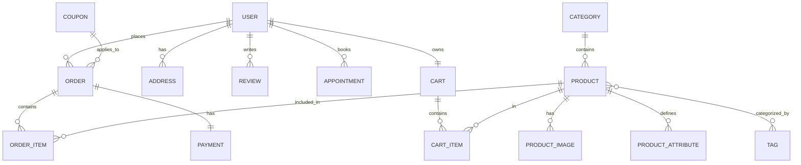

# 13 — Database Reference Guide
> **Purpose:** A comprehensive guide to the Furniture Store database schema, including recent improvements. This document serves as a roadmap for developers to enhance the web application's functionality and user experience.

---

## 1. Catalog & Products
These tables manage the inventory and how products are displayed and filtered.

### Categories
Stores product groupings (e.g., Living Room, Bedroom).
- **CategoryId**: Primary Key.
- **Name**: Display name.
- **ImageUrl**: Hero image for the category.
- **SortOrder**: Controls display sequence in navigation.

### Products
The core inventory table.
- **ProductId**: Primary Key.
- **SKU**: Unique Stock Keeping Unit.
- **Price**: Current list price.
- **StockQuantity**: Real-time inventory count.
- **IsFeatured**: Flag for homepage promotion.

### ProductAttributes (NEW)
Allows for flexible, dynamic specifications without changing the schema.
- **Key**: Attribute name (e.g., "Material", "Wood Type").
- **Value**: Attribute details (e.g., "Solid Oak").
- *Usage:* Use this to build a "Technical Specs" section on the product page.

### Tags & ProductTags (NEW)
Enables many-to-many categorization.
- **Tag Name**: Keywords like "Modern", "Eco-friendly", "Best Seller".
- *Usage:* Use tags to create "Related Products" sections or advanced search filters.

---

## 2. Sales & Checkout
Manages the purchasing flow, discounts, and payment security.

### Orders
Historical record of purchases.
- **Status**: Pending, Shipped, Delivered, etc.
- **TotalAmount**: Snapshot of cost at time of purchase.
- **DeliveryAddress**: Snapshot of the address used.
- **DiscountAmount**: Total saved via coupons.

### Coupons (NEW)
Promotional discount system.
- **Code**: The string users enter (e.g., "SAVE20").
- **DiscountValue**: Percentage or fixed amount.
- **UsageLimit**: Controls how many times a coupon can be used.
- *Usage:* Add a "Coupon Code" field in the checkout cart to increase conversion.

### Payments (NEW)
Detailed transaction tracking.
- **TransactionId**: Reference from Stripe/PayPal.
- **ProviderResponse**: Stores JSON logs for debugging payment failures.
- *Usage:* Build a "Payment History" in the user profile for transparency.

---

## 3. User Experience
Tables that store user preferences and personal data.

### Addresses (NEW)
Multi-address management for customers.
- **AddressName**: e.g., "Home", "Work".
- **IsDefault**: Automatically selected during checkout.
- *Usage:* Create an "Address Book" in the user profile so customers don't have to re-type data.

### Reviews
Customer feedback and social proof.
- **Rating**: 1 to 5 stars.
- **IsVerifiedPurchase**: Automatically set if the user has a delivered order for the product.
- *Usage:* Display "Verified Buyer" badges next to reviews to build trust.

### Appointments
Showroom visit bookings.
- **AppointmentDate**: When the customer plans to visit.
- **ProductInterests**: List of items they want to see in person.

---

## 4. System & Audit
Internal tracking for security and management.

### AuditLogs (IMPROVED)
Comprehensive tracking of administrative actions.
- **OldValues / NewValues**: Stores JSON snapshots of data before and after changes.
- *Usage:* Vital for the Admin Dashboard to track who changed a product price or deactivated a user.

---

## 5. ER Diagram Summary

---

## 6. How to improve the Web App with this Database
1.  **Personalization**: Use `Addresses` to greet users with their city or provide "Fast Shipping to [City]" messages.
2.  **Marketing**: Use `Coupons` to run "Flash Sales" and display timers on the homepage.
3.  **Discovery**: Use `Tags` to suggest "Similar Items" at the bottom of product pages.
4.  **Trust**: Use `Reviews` and `VerifiedPurchase` flags prominently.
5.  **Technical SEO**: Use `ProductAttributes` to generate structured data (Schema.org) for Google search results.
